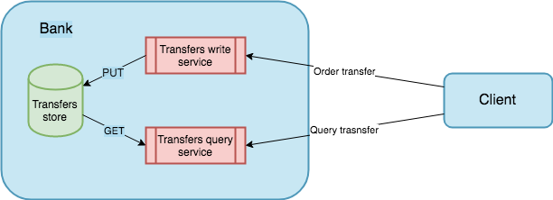
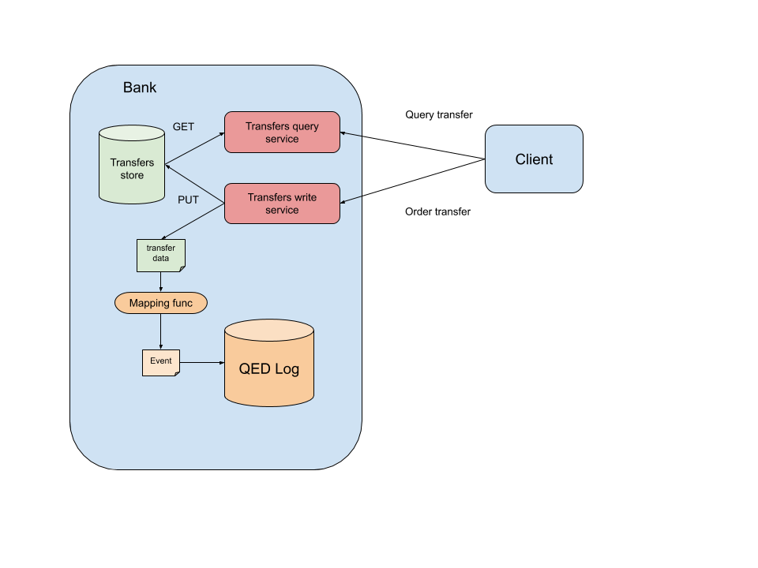
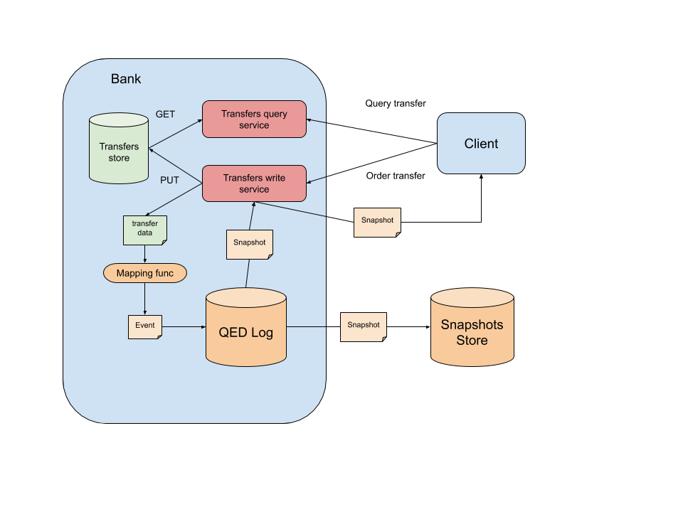
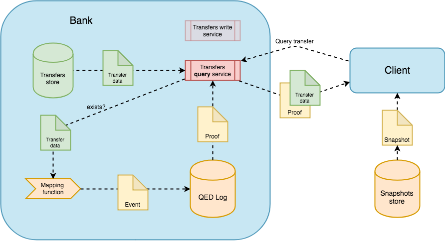
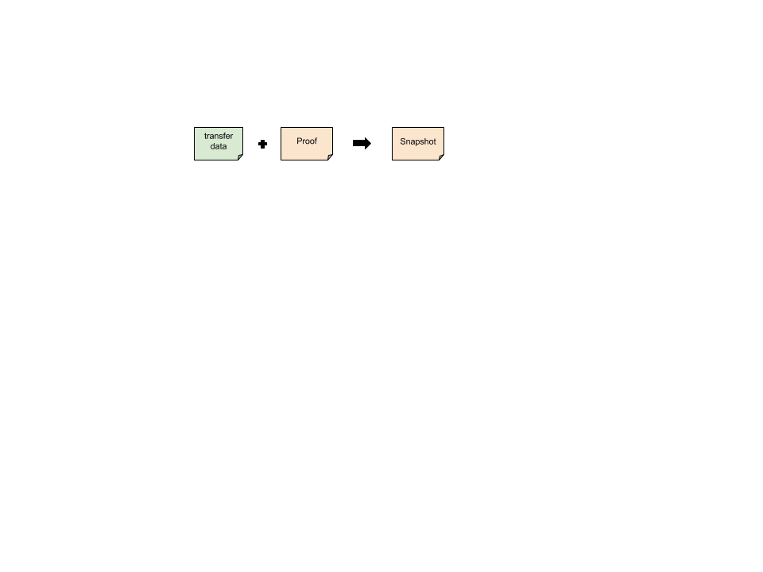

.. _trust_model:

Trust Model
===========

Description
-----------

Before starting to use QED, users need to translate their problem of trust
to a more suitable conceptual model, to allow them to accurately identify which
are the actors that take part in the relationship, and what are the pieces of
data that must be verified.

QED defines a very simple but flexible trust model. It is composed of
three main components:

- The **information** itself to which the users want to add transparency.
- A set of **actors** that interacts with the information in different ways.
- A **mapping function** that translates the information space to a
  univocal event that serves as input for QED.

It is clear that the information depends on the nature of the problem we are
dealing with, and likewise, the mapping function definition is closely
linked to it. Actors can be grouped in three categories
or roles:

- Sources of information.
- Information providers.
- Information consumers.

Let's see a brief example to understand better these concepts and their
interactions with QED.

Simple scenario
---------------

Suppose a scenario where bank customers want to ensure that every
money transfer related to their accounts can be verified later.

Here, the information takes the form of bank transfers which includes
references to the destination accounts, a timestamp, the amount of money
transferred, a concept and probably a set of different internal metadata.

The involved actors are the bank and the customer. The customer plays the role
of the information consumer, and the bank plays both the roles of source and
provider. Note that the bank might be divided in to different services: one
for making transfers and other one for querying them.

In this scenario, QED could help the provider to add transparency to its
internal operations. When the client uses the bank application to order a money
transfer, the application (provider) has to use the mapping function to
transform every transfer data into a QED event that uniquely represents
the event source entry that will be appended to the **QED Log**, which is the
part of QED that stores the information needed to build the proofs. If this
function has some collision, QED might not be able to issue a valid proof.

For instance, a possible event could be::

    {
        “operation code”: “money transfer”,
        “user code”: “0001”,
        “destination”: “IBAN001”,
        “timestamp”: 2019-05-29T10:00:35+00:00,
        “concept”: “transfer money to other account”,
        “amount”: 1000,
        “currency”: “EUR”,
    }

We necessarily have to trust this append process. If the user introduced
incorrect data, he will only be able to verify such incorrect data.

On each append operation, the QED Log will emit a signed token or receipt,
called **snapshot**. This snapshot will be eventually published in a
(maybe public) **snaphots store** outside QED.

To provided transparency, the signed snapshot can also be delivered to
the client, so he could later use it to verify the QED proof about such
operation. In the same way, a third-party could be able to use that
published snapshot to verify the same data. In order to avoid collusion,
a snapshot store might be out of reach of the provider.

At a later time, the client might change his idea about what he did and
demand the bank to proof that he ordered the transfer and/or that nobody
modified the order data on its internal systems.

With a QED-based system, the bank can provide a cryptographically secure
proof that verifies that:

- The QED event was effectively appended and has not been modified since then.
- The event was appended in a precise **temporal order** related to the
  other events from the same client. Those events can also refer to internal
  operations not directly related to the transfer data, allowing to verify
  the complete end-to-end chain of operations derived from the order.

However, the client might argue that these proofs are invalid because the QED
system is deployed on bank premises (under bank control), so someone could
have modified something. But, QED is also resistant to this kind of attacks,
and cannot be tampered without being detected. Also, to avoid tampering, it
is essential to deploy the event source, the QED Log, and the snapshot store
in a way resistant to collusion.

.. note::

    To have a deep comprehension of how QED achieves this ability, please
    refer to the QED's :ref:`security model <security_model>` documentation.

This naive example shows the basic usage of a QED, and help to identify
the fundamental components that QED requires:

- **QED Log**: where the authentication data lives.
- **Snapshot store**: that stores all snapshots generated by QED Log.
- **Events source**: the service that stores the data needed to build QED
  events.
- **Application**: a system/action that works with events source data.
- **Third-parties**: external actors that can use QED or be verified by QED.

There are other components which allow a QED system to be resistant to
tampering:

- **QED gossip network**: a network on which QED emits snapshots.
- **QED agents**: processes subscribed to the gossip network, that execute
  task with the snapshot information: monitoring, auditing, etc.
- **Notification service**: notifies stakeholders of any activity of
  interest like alerts emitted by agents.

.. note::

    To have a deep comprehension of these components and how they interact
    among them, please refer to the
    :ref:`architecture <architecture_and_components>` documentation.

The Use cases section provides a detailed set of examples that apply the
trust model to more complex scenarios.
